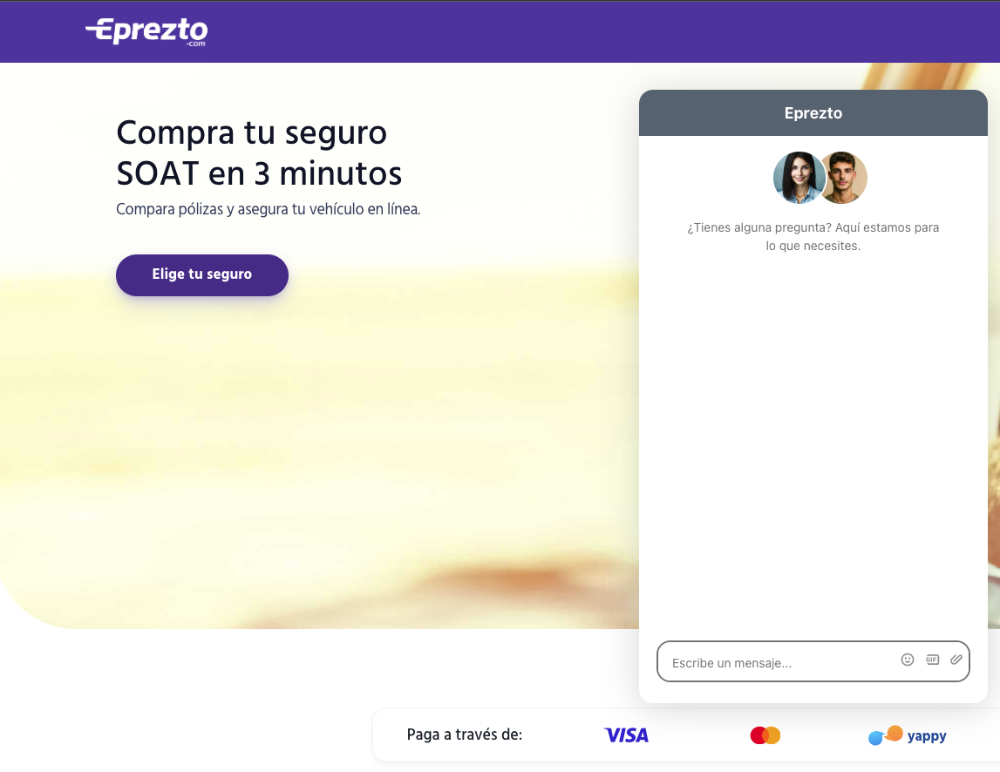

# EPrezto

This is the front and backend of a basic chatbot that I built as part of a test.
It is supposed to be for internal use and if developed fully would help to assist the
agents giving support to the clients and automating some tasks.

It will serve to evaluate the following:
- The correct integration of a Large Language Model (LLM) with a backend and frontend.
- The consumption of actions from the agent - LLM (Fetching user data, Issuing a policy).
- Assembling the set so that it can be used in a demo with the attached data.

This chatbot should be able to communicate with the user, accept queries, access data,
suggest actions and take them. 
The data in this demo is a mocked MongoDB group of 2 customers inside a JSON array.
The responses from the backend are mocked in a way, but it stills using Langchain to improve
the quality of the responses and also analyze some of the user queries.
Building this demo is one of four different tasks of the test. And in this README file
I will place the result of the other 3.

##  Demo


## 1 - System Architecture Diagram


## 2 - List and justification of the chosen stack  
#### Frontend:
- React: It is widely used for interactive web applications and has a rich ecosystem of tools to facilitate the creation of fast user interfaces.
#### Backend:
- Node.js (Express): Excellent for handling asynchronous requests and facilitates integration with external APIs and LLM services.
#### LLM:
- HuggingFace: The Hugging Face community is active and supportive, providing ample resources, documentation, and forums for troubleshooting. This can significantly reduce development time and help teams overcome challenges more efficiently.
- LangChain: Allows integrating different LLM models and better managing AI workflows, which could be useful for handling multiple actions in the future.
- Nginx: Will act as a reverse proxy, managing the load between the frontend and backend, ensuring that connections are secure and scalable.
#### DevOps Tools:
- AWS EC2 and S3: For scalable server deployment and file storage.
- GitHub Actions: For automated CI/CD, ensuring an efficient workflow for deploying new versions.
- Docker: offers numerous advantages, including environment consistency, isolation, scalability, simplified deployment, version control, integration with CI/CD processes, resource efficiency, cross-platform compatibility, and access to a robust ecosystem. 

 This stack is selected for its rapid integration capabilities with APIs and LLMs, cloud scalability (AWS), and extensive documentation and support community.

## 3. Additional Questions (1 Point)
-Explain the Purpose of Adding a Vector Database:
 A vector database would help improve search capabilities by enabling efficient similarity searches, allowing users to find relevant insurance policies based on their preferences. Also it would help with the conversatio, removing the need of call the LLM if some question was already clarified before.

- Dimensioning Hardware for 500 Concurrent Users:
 To support 500 concurrent users, we might need around 250-500 CPU cores and 250-500 GB of RAM, along with sufficient bandwidth. Additionally, we should consider the costs associated with API calls to services like OpenAI.

 -Requirements for a Multimodal Application:
 To make the application multimodal, we would need to support various input types (text, voice, images) and integrate different AI models for each modality, ensuring a smooth user experience across all interactions.

## Getting Started

If you want a copy of this file go to the github repository and download it from there:
- [`https://github.com/Metsanpeitto/EPrezto`](https://github.com/Metsanpeitto/EPrezto)


### Live

[Live](http://www.tienduca.com/eprezto/)


### Setup

```cmd
git clone  hhttps://github.com/Metsanpeitto/EPrezto.git
cd ./EPrezto
```

### Install

Go into the ba
```cmd
npm install
```

### Run both, frontend and backend at the same timelocally in development mode

```cmd
npm run start
```

### Verify linters

- Autofix linters errors

```cmd
npx eslint . --fix
npx stylelint "**/*.{css,scss}" --fix
```

## To run jest test
```cmd
npm run test
npm run jest
```

If you are non a technical person you can download the zip file.

- To do that you have to go to the green button that says 'Code' and then press on it.
- Choose the option 'Download Zip' and wait until it download.
- Then you need to decompress it.
- You will need to have Zip compress file software installed in your computer. If you don't have it you can download it from here
  [`https://www.7-zip.org/download.html`](https://www.7-zip.org/download.html)
- Do double click on the Capstone-1.zip and choose a folder where to place all teh decompressed files.
- Once you are done decompressing, you can open the created folder.
- In it you can double click on the index.html file and choose a browser to open it (For example google Chrome Browser).
- Now you should be able to see the project.
- Remember to use the mouse to navigate through the website. Also you can use the keys 'arrow up' and 'arrow down' of your keyboard
  to scroll up and down. 


### Prerequisites

- Node.JS


## Authors

👤 **Abraham Rodriguez**

- GitHub: [@metsanpeitto](https://github.com/Metsanpeitto)
- LinkedIn: [Abraham Rodriguez](https://www.linkedin.com/in/abraham-rodriguez-3283a319a/)
- Portfolio: [Waldenberg](https://portfolio.waldenberginc.com)

## 🤝 Contributing

Contributions, issues, and feature requests are welcome!
Feel free to check the [issues page](../../issues/).


## Show your support

Give a ⭐️ if you like this project!

[](https://creativecommons.org/licenses/by-nc/4.0/)
[](http://creativecommons.org/publicdomain/zero/1.0/)
